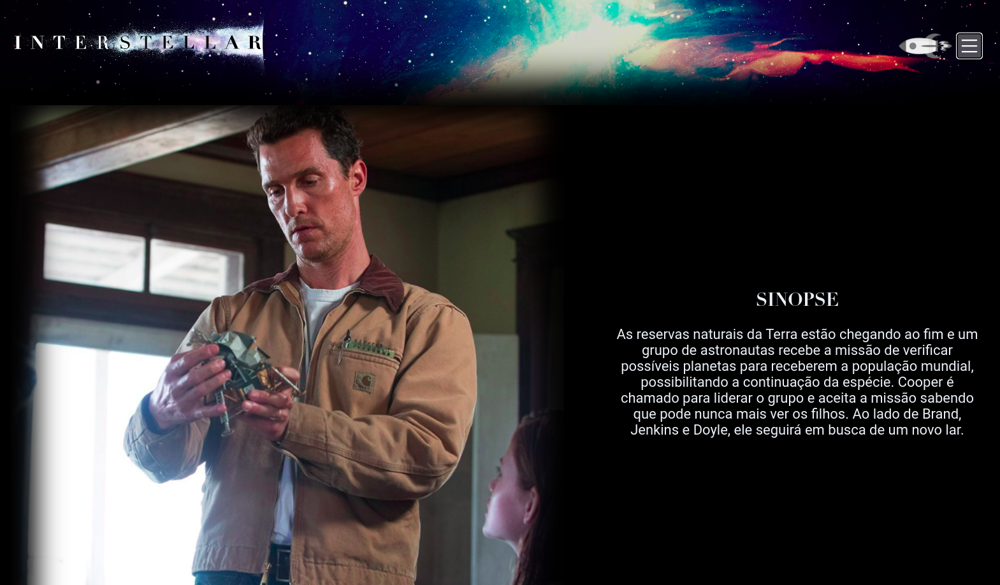

# Landing Page Interestelar

Landing page sobre o filme Interestelar, desenvolvida com HTML e JavaScript, estilizada com SASS e automatizada com Gulp. 
A página inclui sinopse do filme, seções sobre os personagens principais e críticas.
 
 

## Tecnologias Utilizadas

&nbsp;
&nbsp;
&nbsp;
&nbsp;
 
 

## Link Demo: [Landing Page Interestelar](https://landing-interestelar.vercel.app/)

  

